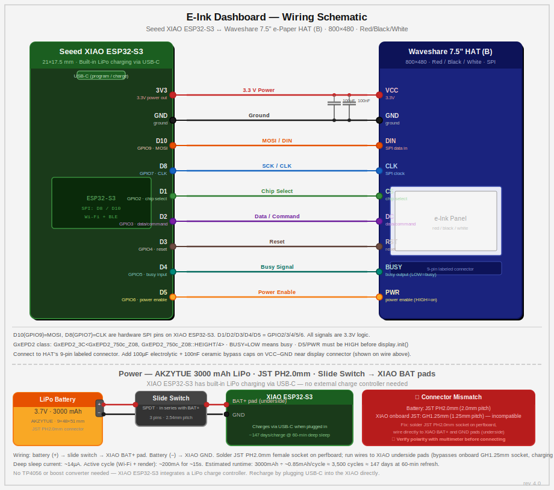

# eInk Dashboard

A personal desk display combining a **Waveshare 7.5" three-color e-ink display** (800×480, red/black/white) with a **Seeed Studio XIAO ESP32-S3**. The ESP32 wakes from deep sleep, fetches JSON from a local Node.js server, renders the display, and sleeps again.



---

## Features

- Current weather (temperature, condition, high/low, precipitation) via Open-Meteo — no API key required
- 5-day forecast strip
- Today's Google Calendar events (up to 3 shown, with overflow count)
- "Last updated" timestamp in the bottom-right corner
- Configurable refresh interval (ESP32 deep sleep between polls)
- Web UI for location config and Google Calendar OAuth connection
- Browser-based display preview (pixel-accurate 800×480 simulation)
- Graceful error banner if the server is unreachable

---

## Hardware

| Component | Detail |
|-----------|--------|
| Display | Waveshare 7.5" e-Paper HAT (B) — 800×480, red/black/white, SPI |
| Microcontroller | Seeed Studio XIAO ESP32-S3 |
| Connection | SPI (display HAT wired directly to ESP32) |
| Network | Wi-Fi, local network only |

### Pin Assignments (XIAO ESP32-S3)

| Pin | GPIO | Function |
|-----|------|----------|
| D1  | 2    | EPD_CS |
| D2  | 3    | EPD_DC |
| D3  | 4    | EPD_RST |
| D4  | 5    | EPD_BUSY |
| D5  | 6    | EPD_PWR |
| D8  | 7    | SPI CLK |
| D10 | 9    | SPI MOSI |

---

## Server Setup

### Prerequisites

- Node.js 18+
- A Google Cloud project with the Calendar API enabled (for calendar integration)

### Install & Run

```bash
npm install

# Development (Vite HMR + live server)
npm run dev

# Production
npm run build
npm start
```

Server runs on port `3000` by default.

### Environment Variables

Copy `.env.example` to `.env` and fill in:

```env
GOOGLE_CLIENT_ID=your_google_client_id
GOOGLE_CLIENT_SECRET=your_google_client_secret
REFRESH_RATE_MINUTES=60   # how often the ESP32 wakes (default: 60)
PORT=3000
```

`GOOGLE_CLIENT_ID` and `GOOGLE_CLIENT_SECRET` are only required for Google Calendar integration. Weather works without any API keys.

### Google OAuth Setup

1. Go to [Google Cloud Console](https://console.cloud.google.com) → APIs & Services → Credentials
2. Create an **OAuth 2.0 Client ID** (Web application)
3. Add `http://<your-server-ip>:3000/auth/callback` as an authorized redirect URI
4. Copy the client ID and secret into `.env`
5. Open the web UI and click **Connect Google Calendar**

---

## Arduino Setup

### Required Libraries

Install via Arduino IDE Library Manager:

| Library | Version |
|---------|---------|
| GxEPD2 | latest |
| ArduinoJson | v7.x |

WiFi and HTTPClient are included with the ESP32 Arduino core.

### Sketches

| Sketch | Description |
|--------|-------------|
| `arduino/EInkDashboardS3/` | **Primary** — XIAO ESP32-S3, full dashboard with deep sleep |
| `arduino/EInkDashboard/` | Freenove ESP32-WROOM variant |
| `arduino/EInkTest/` | Minimal wiring test — no WiFi, draws a test pattern |
| `arduino/EInkS3Blink/` | LED blink test for XIAO ESP32-S3 |
| `arduino/EInkS3GpioTest/` | GPIO validation |
| `arduino/EInkS3Wifi/` | WiFi connectivity test |

### Flash

Edit `EInkDashboardS3.ino` and set your WiFi credentials and server URL:

```cpp
const char* WIFI_SSID     = "your_ssid";
const char* WIFI_PASSWORD = "your_password";
const char* SERVER_URL    = "http://192.168.1.x:3000/api/dashboard-data";
```

Then compile and upload:

```bash
# Compile
arduino-cli compile --fqbn esp32:esp32:XIAO_ESP32S3 arduino/EInkDashboardS3/

# Upload (adjust port as needed)
arduino-cli upload -p COM6 --fqbn esp32:esp32:XIAO_ESP32S3 arduino/EInkDashboardS3/

# Serial monitor
python monitor.py
```

---

## Architecture

```
ESP32 (deep sleep)
  └── wakes every N minutes
  └── GET /api/dashboard-data
  └── parse JSON (ArduinoJson v7)
  └── render display (date=BLACK, weather/calendar=BLACK)
  └── deep sleep

Node.js Server (always-on)
  ├── GET /api/dashboard-data  ← polled by ESP32
  │     ├── weather widget     (Open-Meteo, 30-min cache)
  │     └── calendar widget    (Google Calendar API)
  ├── GET|PUT /api/config       ← read/write lat/lon
  └── GET /api/auth/google/url  ← OAuth popup flow

React UI (served from same server)
  ├── Config tab    — lat/lon + Google Calendar connect
  ├── Preview tab   — live 800×480 display simulation
  └── Arduino tab   — generated sketch with server IP injected
```

Data is stored in a local SQLite database (`data/dashboard.db`) — no cloud services required beyond Google Calendar auth.

---

## API

### `GET /api/dashboard-data`

Returns all data needed to render the display.

```json
{
  "date": "Wednesday, February 25",
  "weather": {
    "tempF": 72,
    "condition": "Partly Cloudy",
    "highF": 78,
    "lowF": 61,
    "precipitationPct": 20,
    "forecast": [...]
  },
  "calendar": {
    "events": [
      { "title": "Standup", "time": "9:00 AM", "allDay": false }
    ],
    "totalCount": 3
  },
  "settings": {
    "refreshRateMinutes": 60
  }
}
```

### `GET /api/config` — read location + calendar connection status
### `PUT /api/config` — save lat/lon
### `GET /api/auth/google/url` — get OAuth URL for popup
### `GET /auth/callback` — OAuth redirect handler

---

## Project Structure

```
├── arduino/               # Arduino sketches
│   ├── EInkDashboardS3/   # Primary sketch (XIAO ESP32-S3)
│   └── EInkDashboard/     # Freenove ESP32-WROOM variant
├── src/
│   ├── components/        # React UI components
│   ├── routes/            # Express API routes
│   ├── widgets/           # Weather + calendar data modules
│   ├── services/          # (legacy) service layer
│   ├── db.ts              # SQLite key-value store
│   └── constants/         # DB key constants
├── example/               # Waveshare reference implementations
├── docs/                  # Design docs and plans
├── server.ts              # Express server entry point
├── SPEC.md                # Full feature specification
└── ARCHITECTURE.md        # Detailed system design
```
